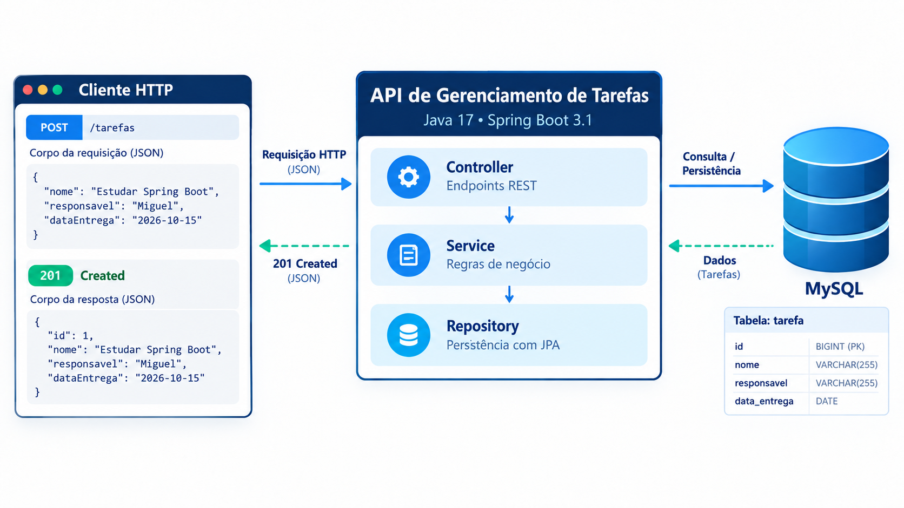

# API de Gerenciamento de Tarefas

[](https://github.com/MiguelZGobbo/API-de-Gerenciamento-de-Tarefas/actions/workflows/ci.yml)

API REST para cadastrar e consultar tarefas identificadas por nome, responsável e data de entrega. O projeto começou como trabalho acadêmico de Desenvolvimento Web Back-end e foi aprimorado para demonstrar, em um escopo funcional, práticas essenciais de desenvolvimento backend com Java.

A API centraliza as operações desse cadastro e mostra como organizar um CRUD com validação, persistência versionada, respostas HTTP previsíveis e testes automatizados.



## O que já faz

- Cria, lista, consulta, atualiza e exclui tarefas.
- Valida os campos `nome`, `responsavel` e `dataEntrega`: textos são obrigatórios, não podem ficar em branco e têm limite de 255 caracteres; a data é obrigatória e usa o formato `yyyy-MM-dd`.
- Persiste as tarefas em MySQL e cria o schema com migrações Flyway.
- Retorna `201` na criação, `200` nas consultas e atualizações, `204` na exclusão, `400` para entradas inválidas e `404` quando a tarefa não existe; os erros seguem `ProblemDetail`.
- Documenta os endpoints com Swagger UI e OpenAPI.

## Stack

Java 17 · Spring Boot 3.1.12 · Spring MVC · Spring Data JPA · Bean Validation · MySQL 8 · Flyway · springdoc OpenAPI · Maven Wrapper · Docker Compose · JUnit 5 · Mockito · MockMvc · GitHub Actions

## Executar localmente

**Pré-requisitos:** Java 17 e Docker com Docker Compose. O Maven Wrapper incluído baixa e usa a versão de Maven configurada no projeto.

```bash
git clone https://github.com/MiguelZGobbo/API-de-Gerenciamento-de-Tarefas.git
cd API-de-Gerenciamento-de-Tarefas
```

Copie o exemplo de configuração e inicie o banco:

**Linux/macOS**

```bash
cp .env.example .env
docker compose up -d --wait
DB_USERNAME=tarefas DB_PASSWORD=tarefas_dev_password ./mvnw spring-boot:run
```

**Windows (PowerShell)**

```powershell
Copy-Item .env.example .env
docker compose up -d --wait
$env:DB_USERNAME = 'tarefas'
$env:DB_PASSWORD = 'tarefas_dev_password'
.\mvnw.cmd spring-boot:run
```

A API ficará disponível em `http://localhost:8080`. Para encerrar o banco, use `docker compose down`.

O Docker Compose carrega as configurações de `.env`. Ao iniciar a aplicação pelo Maven Wrapper, as variáveis da conexão também precisam estar disponíveis no terminal. Os comandos acima usam os valores locais do `.env.example`; se alterar as credenciais, atualize também as variáveis no terminal. Não use credenciais reais nesse arquivo.

| Variável | Finalidade |
| --- | --- |
| `DB_URL` | URL JDBC da aplicação. Opcional para o MySQL local na porta 3306; configure para usar outro endereço. |
| `DB_USERNAME` | Usuário MySQL da aplicação e do contêiner; obrigatório para iniciar a aplicação. |
| `DB_PASSWORD` | Senha do usuário; obrigatória para iniciar a aplicação. |
| `MYSQL_ROOT_PASSWORD` | Senha do root do contêiner; opcional, com valor local padrão. |

## Como foi construída

O fluxo segue `Controller → Service → Repository → MySQL`. O controller recebe e devolve DTOs e valida as requisições; o service concentra as operações da aplicação; e o repository acessa os dados com Spring Data JPA. A entidade JPA fica interna, e um handler global transforma erros em respostas `ProblemDetail`.

O Flyway cria o schema a partir de migrações versionadas. Na inicialização, o Hibernate valida o schema existente.

```text
src/main/java/com/miguel/tarefas/
  controller/  # endpoints REST
  dto/         # contratos de entrada e saída
  service/     # operações da aplicação
  repository/  # acesso a dados
  model/       # entidade JPA
  exception/   # exceções e respostas de erro
src/main/resources/db/migration/  # migrações Flyway
src/test/java/com/miguel/tarefas/ # testes de controller, service e integração
.github/workflows/ci.yml          # automação de build e testes
compose.yml                       # MySQL para desenvolvimento local
.env.example                      # variáveis com valores de desenvolvimento
.mvn/wrapper/                     # configuração do Maven Wrapper
mvnw / mvnw.cmd                   # execução em Linux/macOS e Windows
```

## Testes e automação

Execute os testes rápidos sem precisar iniciar o MySQL:

```bash
./mvnw test
```

No Windows, use `.\mvnw.cmd test`.

Os testes de controller e service cobrem operações do CRUD, validações e erros. O teste de integração verifica o fluxo HTTP contra MySQL real, a migração do Flyway e o endpoint OpenAPI. Para executá-lo localmente, inicie o Compose e informe as mesmas credenciais do `.env.example` ao terminal:

**Linux/macOS**

```bash
docker compose up -d --wait
DB_USERNAME=tarefas DB_PASSWORD=tarefas_dev_password ./mvnw -Pintegration-tests verify
```

**Windows (PowerShell)**

```powershell
docker compose up -d --wait
$env:DB_USERNAME = 'tarefas'
$env:DB_PASSWORD = 'tarefas_dev_password'
.\mvnw.cmd -Pintegration-tests verify
```

O [GitHub Actions](https://github.com/MiguelZGobbo/API-de-Gerenciamento-de-Tarefas/actions/workflows/ci.yml) executa os testes rápidos e a integração com MySQL pelo Docker Compose em cada push e pull request. O Dependabot verifica atualizações semanais das dependências Maven e das GitHub Actions.

## Documentação e endpoints

Com a aplicação em execução, acesse o [Swagger UI](http://localhost:8080/swagger-ui.html) ou o [documento OpenAPI](http://localhost:8080/v3/api-docs). A collection para Postman está em [`API Tarefas.postman_collection.json`](./API%20Tarefas.postman_collection.json).

| Método | Rota | Descrição |
| --- | --- | --- |
| `POST` | `/tarefas` | Criar tarefa |
| `GET` | `/tarefas` | Listar tarefas |
| `GET` | `/tarefas/{id}` | Consultar tarefa |
| `PUT` | `/tarefas/{id}` | Atualizar tarefa |
| `DELETE` | `/tarefas/{id}` | Excluir tarefa |

## Decisões técnicas

- **DTOs separados da entidade JPA:** deixam explícito o contrato HTTP e permitem validar dados antes da persistência.
- **Camadas simples:** controller, service e repository distribuem responsabilidades sem acrescentar abstrações desnecessárias ao CRUD.
- **Flyway e `ddl-auto=validate`:** versionam a criação do schema e verificam se o banco corresponde ao mapeamento da aplicação.
- **Testes rápidos e de integração:** permitem validar regras sem banco local e também verificar o comportamento completo com MySQL.

Projeto desenvolvido por [Miguel Zager Gobbo](https://github.com/MiguelZGobbo).
